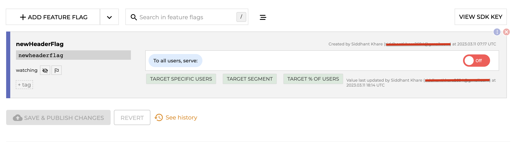
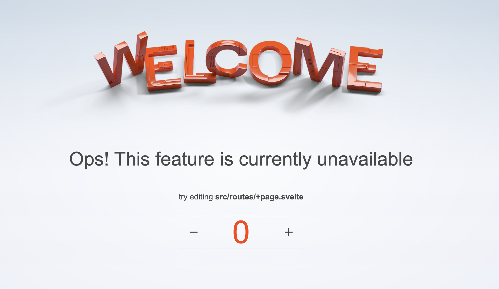
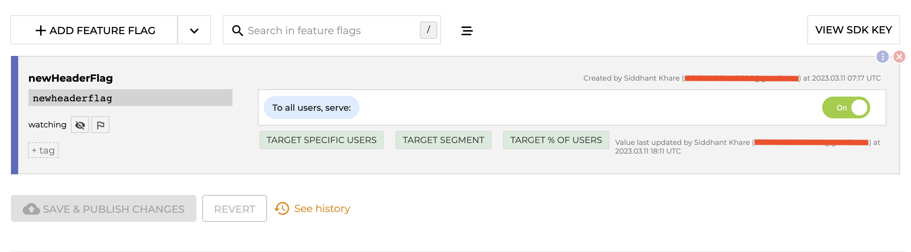
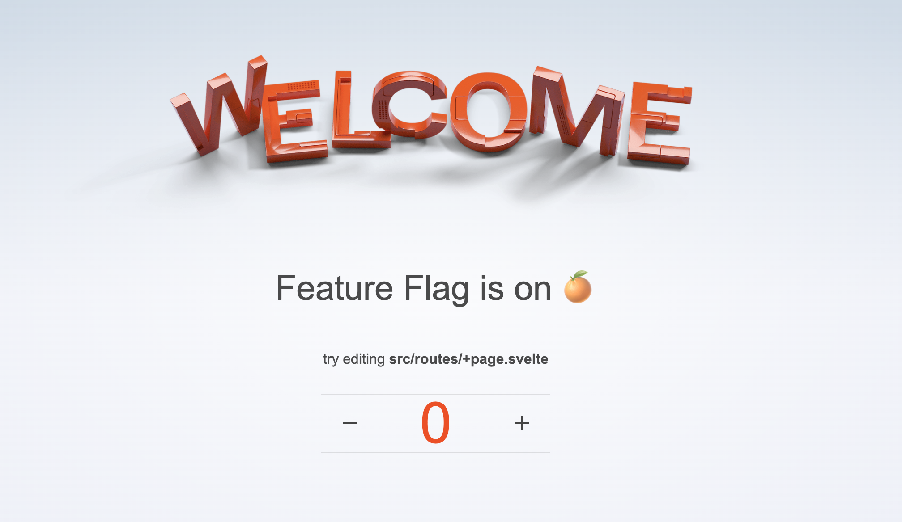

# Svelte-Configcat

[](https://gitpod.io/#https://github.com/Siddhant-K-code/svelte-configcat)

This is a sample project to demonstrate how to use [ConfigCat](https://configcat.com) with [Svelte](https://svelte.dev). It uses the [ConfigCat Svelte SDK](https://configcat.com/docs/sdk-reference/js/) to fetch feature flags from the ConfigCat CDN.

## Developing

Once you've created a project and installed dependencies with `npm install` (or `pnpm install` or `yarn`), start a development server:

```bash
npm run dev

# or start the server and open the app in a new browser tab
npm run dev -- --open
```

## Demo

| Feature Flag |                     ConfigCat Dashboard                     |               Svelte App                |
| :----------: | :---------------------------------------------------------: | :-------------------------------------: |
|     Off      |  |  |
|      On      |   |   |
